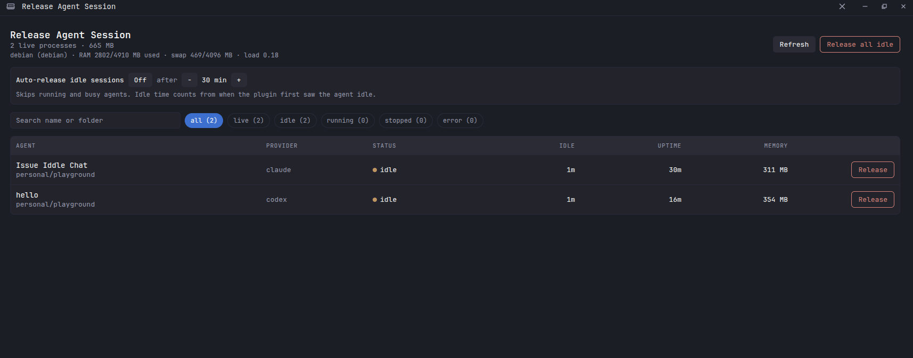
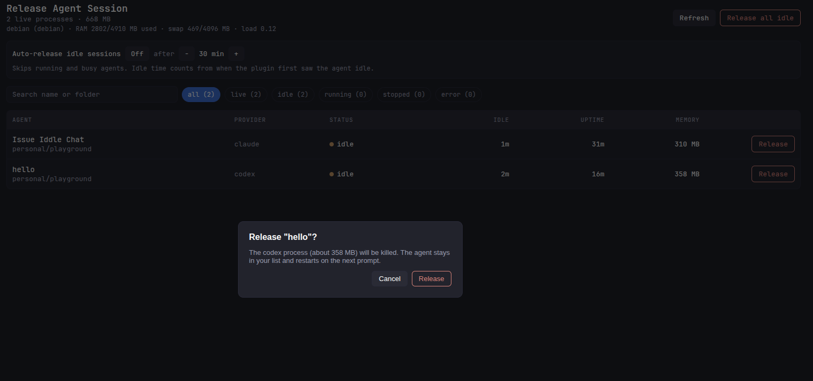
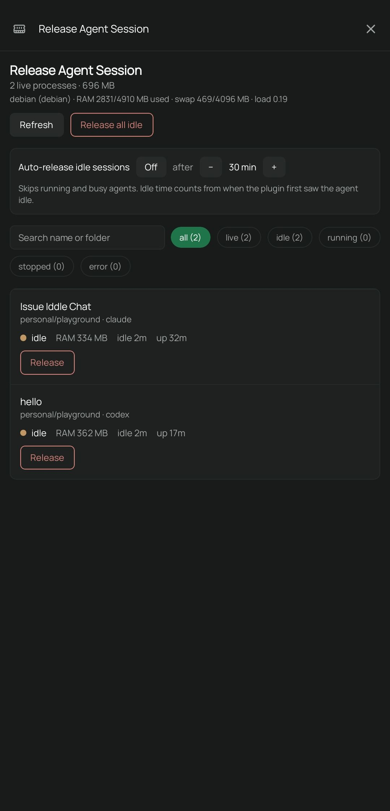

# paseo-release-agent

A [Paseo](https://paseo.sh) plugin that lists agent sessions with their memory use and releases (kills) the provider process of idle ones, without archiving the agent. The agent stays in your list and the provider restarts on the next prompt.

Built for hosts with little RAM, where idle Claude/Codex processes (200-500 MB each) add up.







## Features

- Sidebar page "Release Agent Session": table on wide screens, cards on mobile.
- Per agent: status, provider, idle time, process uptime, memory.
- Host summary: RAM, swap and load of the daemon host.
- Search and status filters.
- Release one agent, or release all idle agents, each behind a confirmation dialog.
- Optional auto-release after N idle minutes (off by default).
- Supported providers: Claude and Codex (see `isProviderProc` in `server/procs.ts` to add more).

## Safety rules

- `running` agents are never released, not even with Force.
- Agents with background processes (bash, monitors, subagents) are marked `busy`. Bulk release and auto-release skip them. A single busy agent can be released with Force, after confirmation.
- Idle time for auto-release counts from when the plugin first saw the agent idle, so it can underestimate real idleness.

## Install

Plugins install per daemon. Run on every host you want it on:

```bash
paseo plugin install <git-url-or-local-path>
paseo plugin ls
paseo plugin logs paseo-release-agent
```

Installing trusts the plugin: its server code runs unsandboxed with the daemon user's access. Read `server/` first.

Reload the app tab after installing or updating.

## Limitations

- Linux only. Processes and memory are read from `/proc`.
- Release only affects processes on the host where the daemon runs.
- The `stopped` label and idle timers live in memory and reset when the plugin reloads.
- Paseo records a killed session as `error`; this plugin only relabels it `stopped` in its own table.
- Auto-release stays dormant until the plugin receives its first agent event or page request after a restart.
- Killing a session loses its in-flight background work, hence the `busy` guard.

## Development

```bash
npm install
npm run typecheck
npm test
paseo plugin reload paseo-release-agent
```
